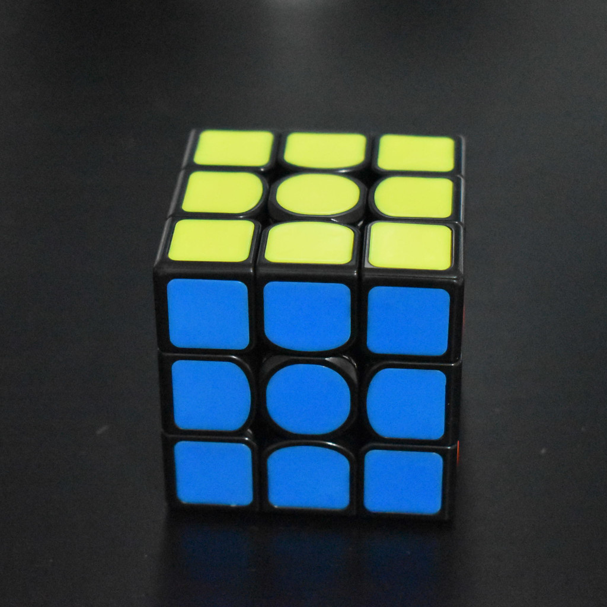
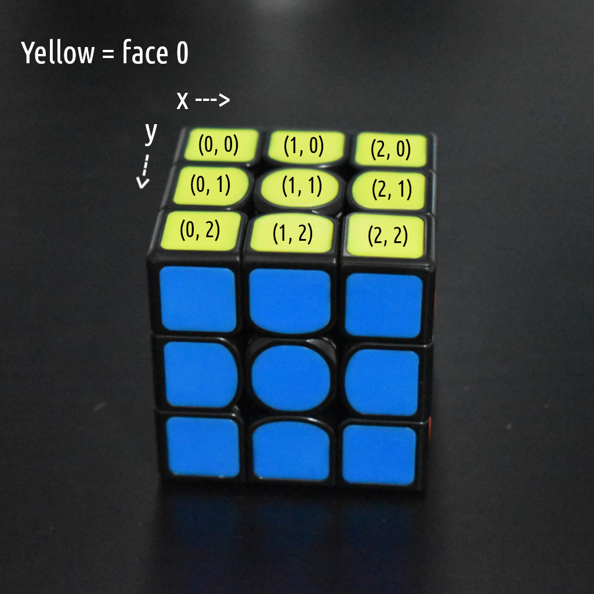
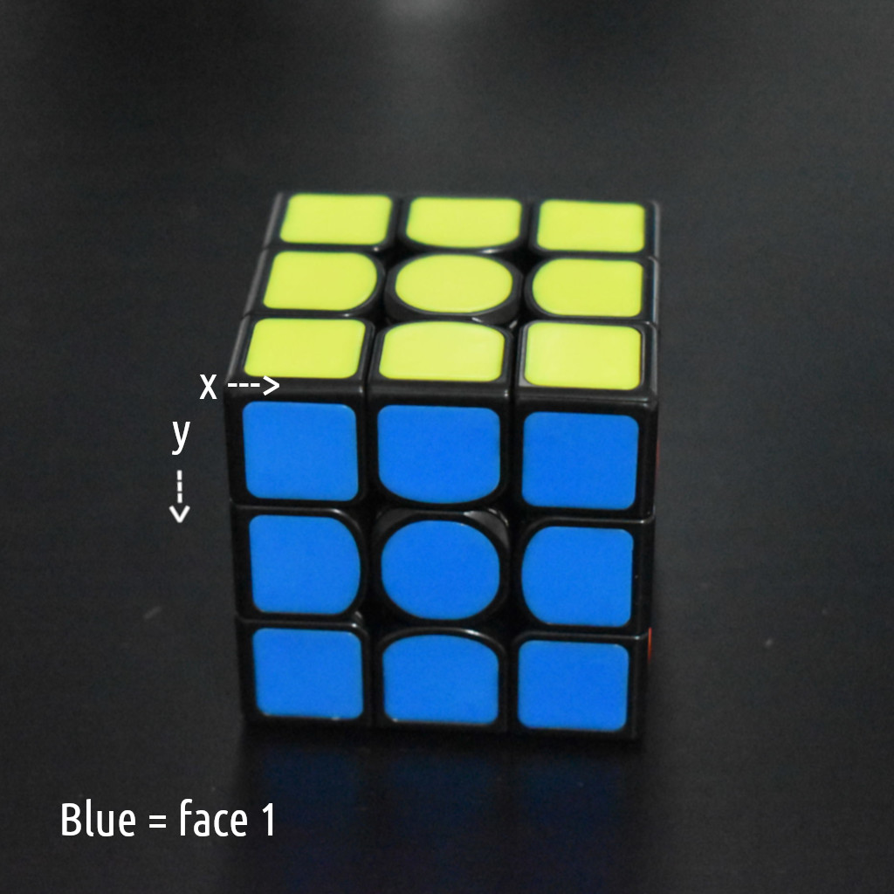
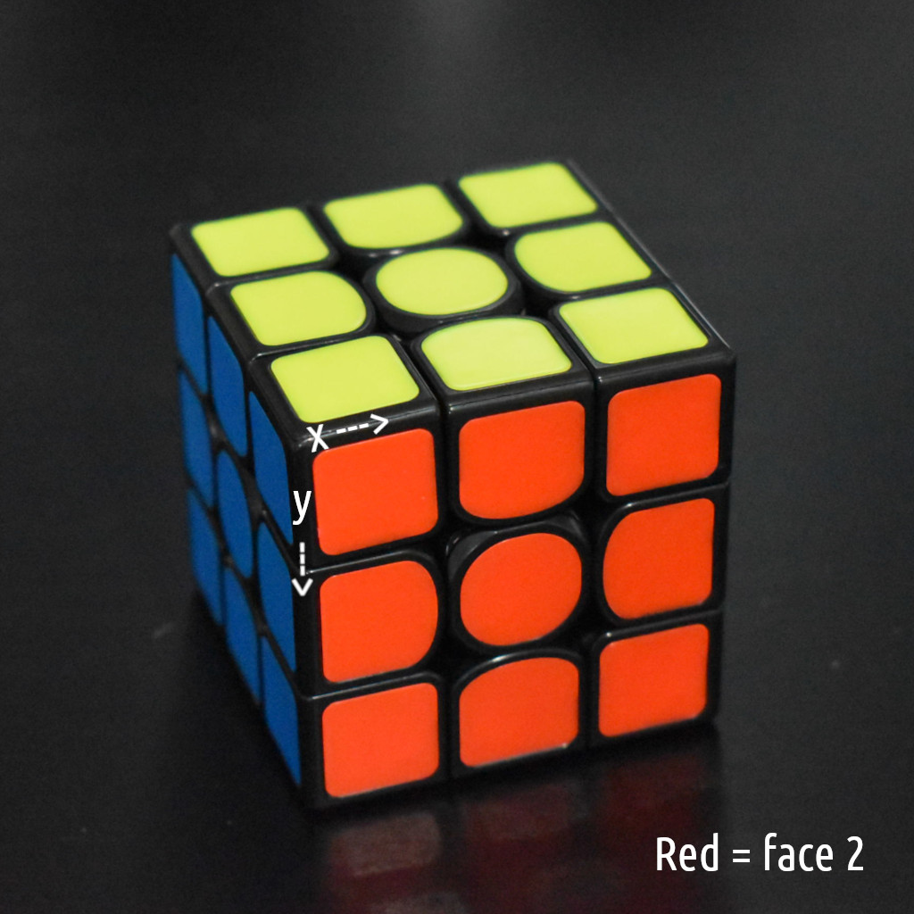
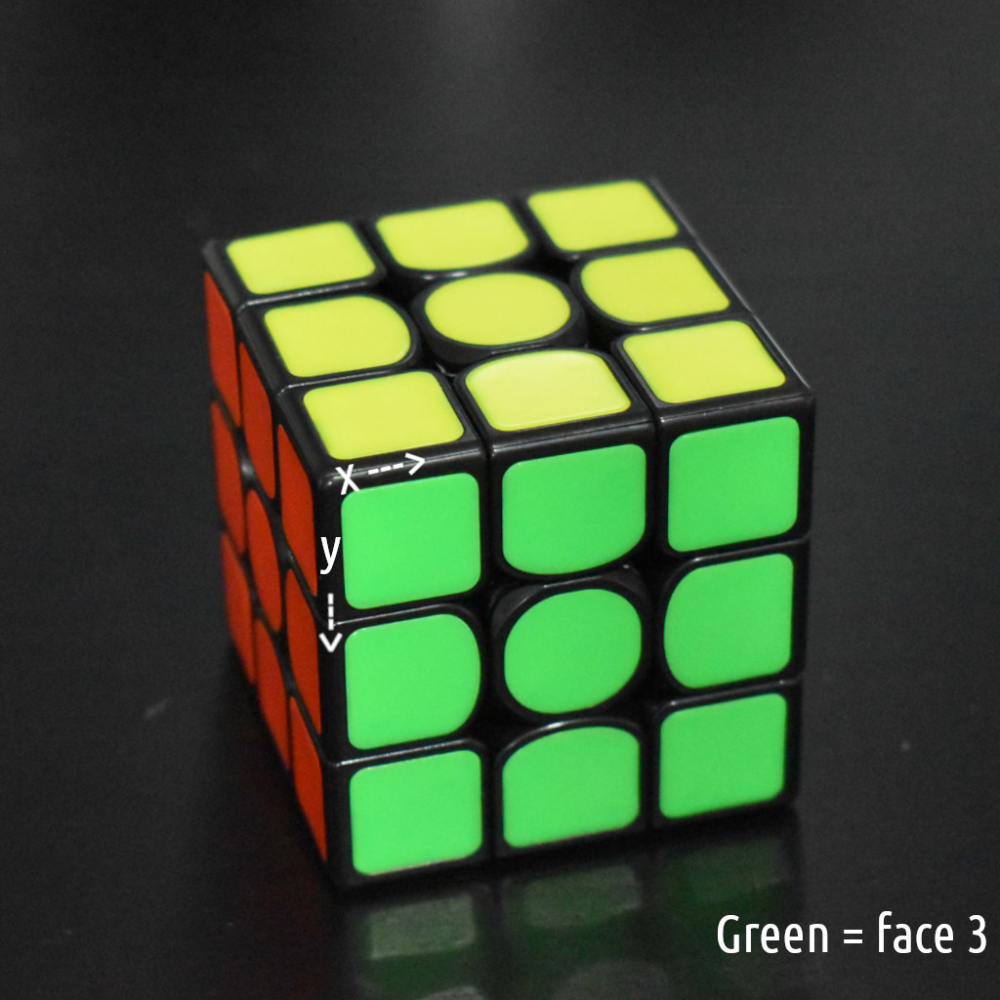
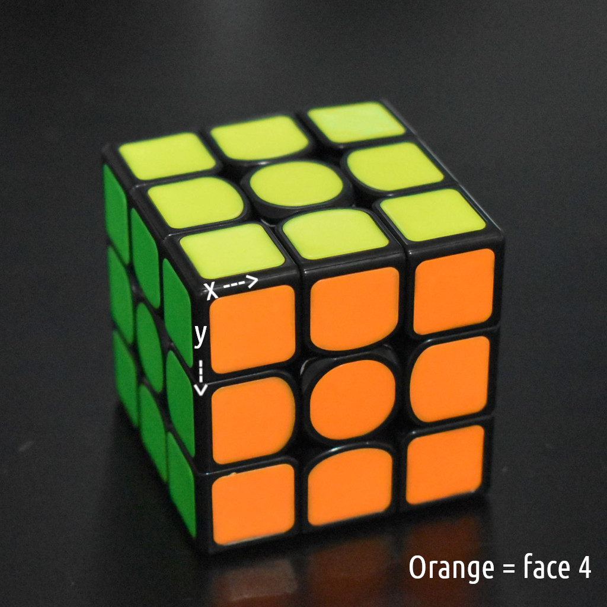
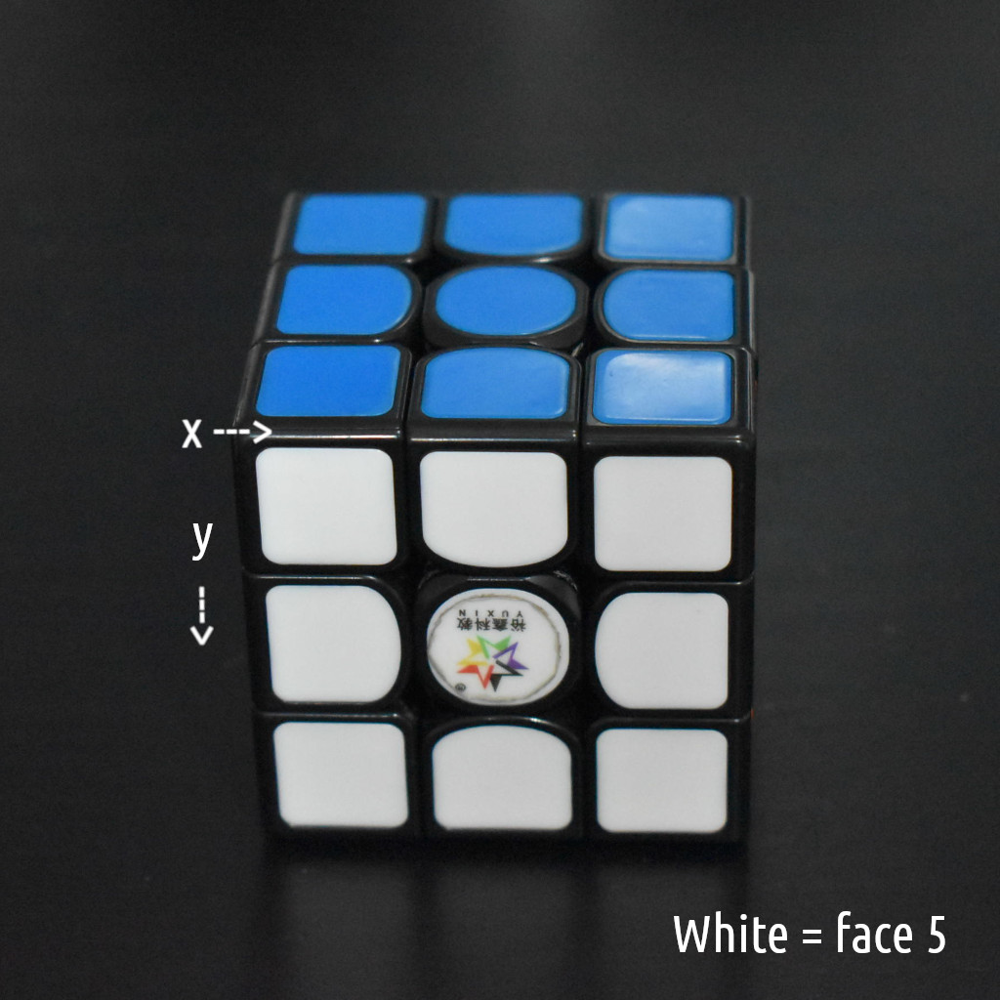

Face Order
==========

Which pieces correspond to which indices in the internal representation?

Representation
--------------

The internal representation is a numpy array of shape ``(6, n, n)``, where
``n`` is the size of the cube.

If you have the indices ``face``, ``x``, ``y`` (described later), you can
obtain the *color* of the sticker at that location with

``color = state[face][y][x]``

The next section describes how to find those indices.

Indices
-------

First, orient the cube with yellow on top and blue facing you:

The yellow side has ``face = 0``. The ``x`` and ``y`` values for each sticker
are:

The blue side is ``face = 1``. The ``x`` and ``y`` axes behave similarly.

Now rotate the cube clockwise. The red face is ``face = 2``.

Rotate again. Green is ``face = 3``.

Again. Orange is ``face = 4``.

Now rotate back to the blue face. We already numbered it before.

Rotate it forward to reveal the white face, which is ``face = 5``.

3D Coords
---------

The point ``(0, 0, 0)`` is the Orange, Blue, White corner.

X increases towards Red.

Y increases towards Green.

Z increases towards Yellow.
